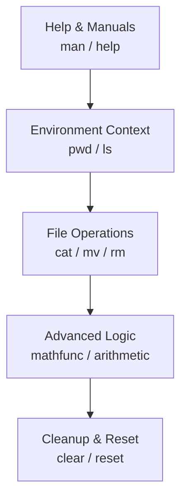

# Zsh Command Reference & Shell Fundamentals (24 May 2024) 🐚

This documentation provides a comprehensive guide to the essential Zsh commands and shell concepts explored during our recent technical session. From file manipulation to advanced arithmetic, these tools form the backbone of a productive terminal workflow. 🚀

## Core Command Set

| Command/Concept | Responsibility |
| --- | --- |
| `cat << EOF` | Streamline file creation with multi-line "heredoc" input. |
| `mv` | Handle file relocation and renaming within the filesystem. |
| `rm` / `rm -r` | Execute permanent removal of files and recursive directory deletion. |
| `man` / `info` | Navigate the primary system manuals and interactive documentation. |
| `zmodload` | Load optional Zsh modules, specifically for math functionality. |
| `pwd` / `ls` | Provide spatial context and directory content inspection. |
| `unalias` / `command` | Manage command precedence and bypass shell aliases. |

## Session Flow



## Detailed Usage

### 📄 File Creation & Heredocs
To create a file with multiple lines quickly, we use a "Heredoc" (Here Document). This allows us to pipe a block of text directly into a file without opening an editor. ✍️

```bash
cat << EOF > notes.md
This is line one.
This is line two.
EOF
```
*   **How it works:** `cat` starts reading until it sees the string `EOF` (End of File) on its own line.
*   **ELI5:** It's like telling your computer, "Hey, start listening to everything I type, and stop only when I say 'EOF', then put all that into this file." 🎒

### 📂 File & Directory Management
Managing the lifecycle of your files is critical.

*   **`mv <source> <target>`**: Used for both **moving** and **renaming**. 
    *   If the target is a directory, the file moves *into* it.
    *   If the target is a new filename, the file is **renamed**.
*   **`rm <file>`**: Deletes a single file. 🗑️
*   **`rm -r <directory>`**: Deletes a directory and everything inside it (**recursive**). Use with caution!

### 📚 Information & Manuals
Never guess what a command does. Use the built-in documentation! 📖

*   **`man <cmd>`**: The standard manual page.
*   **`info <cmd>`**: Often more detailed than `man`, with links.
*   **`builtin help`**: Specifically for shell built-ins (like `cd` or `alias`).
*   **`compgen -c`**: Lists all commands available to your shell.

### 🔢 Zsh Math Module & Arithmetic
Zsh is surprisingly good at math, but you have to tell it to be smart about floating points. 🧮

```zsh
# Load the math functions
zmodload zsh/mathfunc

# Basic Integer math
echo $(( 10 + 5 ))

# Floating point importance
echo $(( 21 / 71 ))    # Returns 0 (Integer division)
echo $(( 21.0 / 71 ))  # Returns 0.2957... (Floating point)
```
*   **ELI5:** If you don't use a decimal point (like `.0`), the computer acts like a grumpy child who refuses to give you "the pieces" of a number, only the "whole" parts. 🧩

### 🛠️ Session Management & Troubleshooting
Keep your workspace clean and understand your environment. 🧹

*   **`pwd`**: "Print Working Directory" - Tells you exactly where you are.
*   **`ls -la`**: Lists all files, including hidden ones (`-a`) and detailed info (`-l`).
*   **`unalias <name>`**: Removes a shortcut (alias) you previously set.
*   **`command <cmd>`**: Runs the "real" command, ignoring any aliases you have.
*   **`clear` / `reset`**: `clear` wipes the screen; `reset` completely restarts the terminal state (useful if the text goes wonky).

## Glossary of Terms

| Term | Full Name | Definition |
| --- | --- | --- |
| **cat** | Concatenate | Links files together or displays them. |
| **EOF** | End of File | A marker indicating the end of a data stream. |
| **zsh** | Z Shell | An extended Bourne shell with many improvements. |
| **UNIX** | Uniplexed Information and Computing Service | The grandfather of modern operating systems. |

## Cohesion & Coupling

In our workflow, these commands are loosely coupled but highly cohesive. For example, `pwd` and `ls` provide the necessary context for `mv` and `rm` to operate safely. By using `man` or `help` before executing complex `rm` commands, we ensure a high degree of operational safety. The arithmetic module integration demonstrates Zsh's extensibility, allowing us to perform complex logic without leaving the shell environment. 🖇️
